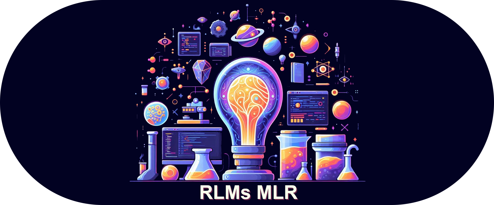

# R.L.M's Machine Learning Recipe
Welcome to this incredible module! With this module, you can utilize my code, which may not be the best, to write your 
own code, which may also not be the best, all in the pursuit of training an AI to generate code that most certainly is
not the best. (Disclaimer: That was a joke. The code isn't that amazing. But hey, you could always try training an AI to 
master digit recognition on the MNIST dataset! Even better, Right?) 

## Installation
The template was created using [uv](https://docs.astral.sh/uv/). If you do not have uv installed, you can probably 
install it using the following command:
```bash
pip install uv
```
Otherwise, detailed instructions can be found on the [uv documentation](https://docs.astral.sh/uv/getting-started/installation/).
It is still possible to run the code without uv, but you would have to manually install the dependencies listed in the
[pyproject.toml](pyproject.toml) file. I strongly recommend using uv, as it will automatically install the dependencies, 
a python versions, and a virtual environment for you --- its awesome.

## Configuration
This template extensively leverages hydra for configuration management. The configuration is loaded using 
hydra\omegaconf and instantiated as a Config dataclass, defined in [config.py](src/config.py). The structure of the 
configuration file structure is as follows:
```txt
├───configs
│   │   config.yaml (the base configuration)
│   │
│   ├─── evaluate (subconfig 1)
│   │       fashion_mnist.yaml (option 1)
│   │       mnist.yaml (option 2)
│   │
│   ├───system (subconfig 3)
│   │       robins_system.yaml (option 1)
│   │
│   ├───train (subconfig 4)
│   │       fashion_mnist.yaml (option 1)
│   │       mnist.yaml (option 2)
│   │
│   ├───visualize (subconfig 5)
│   │       fashion_mnist.yaml (option 1)
│   │       mnist.yaml (option 2)
│   │
│   ├───hp_tuning (Hydra optuna configuration)
│   │       lr_demo_search.yaml (option 1)
│   │
│   ├───experiment (list of experiments, that override the base configuration using selected subconfigs)
│   │       fashion_mnist.yaml (option 1 --- loads all fashion_mnist subconfigs)
│   │       mnist.yaml (option 2 --- loads all mnist subconfigs)
```
Each subconfiguration is defined as a nested dataclass of the main Config dataclass, all defined in [config.py](src/config.py).
This class also defines the default values for the subconfigurations, which are then overridden by the configuration 
files. Note that there can be missing values in the default configuration, which have to be filled in by the 
subconfiguration file. The hp_tuning configuration is used for hyperparameter tuning using optuna, and it automatically
overrides the configuration otherwise specified by default or using one of the other configuration files. The experiment
directory contains specific experiment configurations, that are each comprised of a list of subconfigurations, 
representing a specific experiment.


## Usage

### Running experiments
The code should be run using one of the defined experiments. Assuming uv is installed, you can run the code using the 
following command:
```bash
uv run src/main.py +experiment=[experiment_name]
```
Note that uv automatically uses the .venv it created, so you should run it from outside the venv. You can also specify
subconfigurations or specific parameters from the command line as follows:
```bash
uv run src/main.py +experiment=[experiment_name] +[subconfig]=[subconfig_option] +[subconfig].[parameter_name]=[parameter_value]
```

### Running multiple experiments at once
Alternatively, you can run multiple experiments with one command as follows:
```bash
uv run src/main.py +experiment=[experiment_option1],[experiment_option2],...,[experiment_optionN] --multirun
```

### Running hyperparameter tuning
To run hyperparameter tuning, you can load a hp_tuning configuration as follows:
```bash
uv run src/main.py +experiment=hp_tuning +hp_tuning=[hp_tuning_option] --multirun
```
By specifying the `hydra.sweeper.storage` option in the hp_tuning configuration, you can choose the storage backend for
optuna. During the tuning process, this will save the results of the trials to the specified database. You can 
load a previously saved database by specifying the `hydra.sweeper.storage` and 'hydra.sweeper.study_name' options in the
hp_tuning configuration. This will continue the tuning process from the specified study. This database can
be accessed using the optuna dashboard, which can be started using the following command:
```bash
optuna-dashboard sqlite:///path/to/database.db
```

#### Distributed hyperparameter tuning
NOTE: this is a work in progress. The code is not yet fully functional.

You can create an RDB and create a study for it using optuna. For example, with postgresql:
```bash
psql -U [username] -c "CREATE DATABASE [database_name]"
```
Then, you can specify the database URL in the hp_tuning configuration as follows:
```yaml
hydra:
    sweeper:
        ...
        storage: "postgresql://[username]:[password]@[host]:[port]/[database_name]"
```
