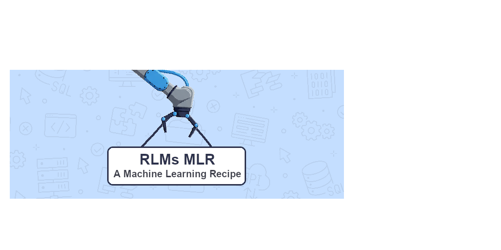

y

# R.L.M's Machine Learning Recipe
Welcome to this incredible repo! With this module, you can utilize my code, which may not be the best, to write your 
own code, which may also not be the best, all in the pursuit of training an AI to generate code that most certainly is
not the best. (Disclaimer: That was a joke. The code isn't that amazing. But hey, you could always try training an AI to 
master digit recognition on the MNIST dataset! Even better, Right?) 

## Installation
...

## Usage
...

## TODO
- [ ] Separate core components from specific implementations using plugins (separate architectures, datasets, etc.)
- [ ] Integrate hyperparameter tuning
- [ ] Integrate data augmentation methods (kornia, albumentations, etc.)
- [ ] Write tests 